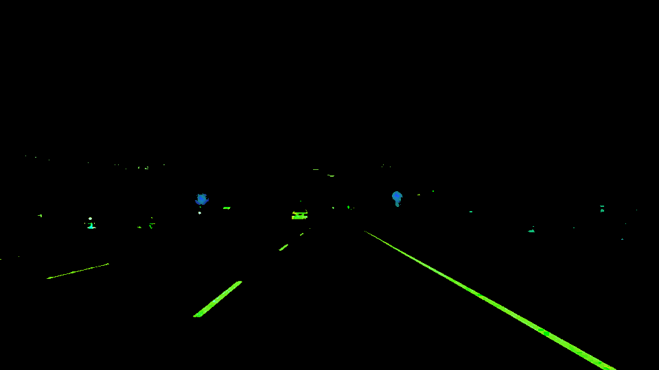
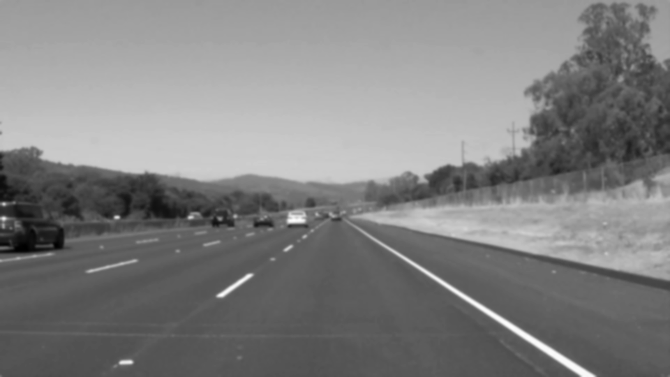
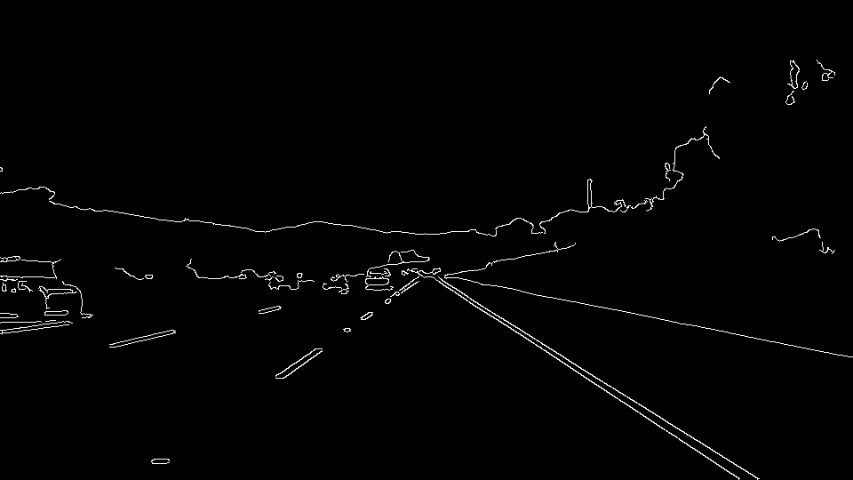
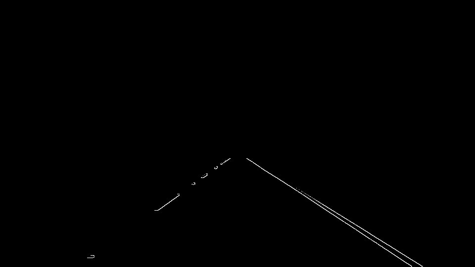
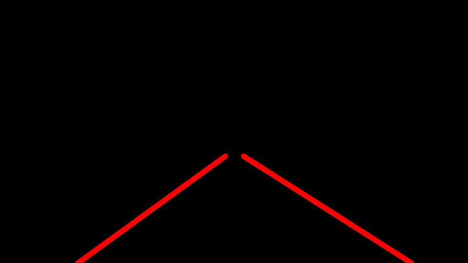
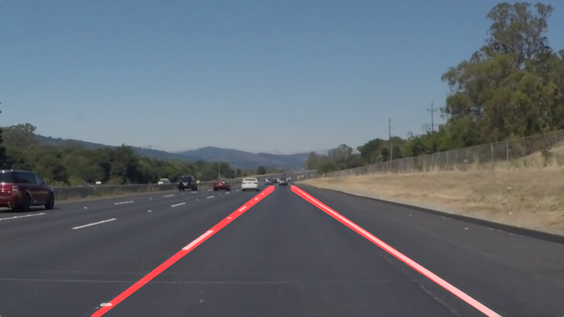

# **Finding Lane Lines on the Road**

---

**Finding Lane Lines on the Road**

The goals / steps of this project are the following:
* Make a pipeline that finds lane lines on the road
* Reflect on your work in a written report

---

### Reflection

### 1. Describe your pipeline. As part of the description, explain how you modified the draw_lines() function.

The pipeline consists of these main steps:
1. Convert image to HSL to better separate lanes using `cv2.cvtColor`

2. Isolate yellow and white with masks using `cv2.inRange`. This helps get rid of shadows and smudges on the road.

3. Convert image to grayscale. This has the effect of speeding up processing since we are dealing with only one channel.

4. Gaussian blur with kernel_size (5,5) to remove noise and high-frequency pixels in the image

5. Apply Canny detection with threshold 50 - 150

6. Apply region of interest. The vertices are hardcoded but extendable to different image sizes.

5. Apply Hough transformation with `rho = 1`, `theta = np.pi/180`,
  `threshold = 15`, `min_line_length = 10`, `max_line_gap = 40`
  

6. Overlay the result of Hough transformation on the original image

In the `draw_line()` function, I performed the following steps:
1. Calculate the slope of each pair of points in Hough transformation
2. We expect the slopes of the lanes to be within a certain range of value. In this case I have chosen [-.9,-.4], [.4, .9]. All sets of lines with slopes outside these range are eliminated.
3. Parse the set of valid lines into x,y coordinates for the left and right lane based on sign of slope
4. Fit a line using `np.polyfit` to find the line parameters.
5. Determine the top of the region of interest.
6. Calculate the endpoints based on 4&5
7. Draw lines

### 2. Identify potential shortcomings with your current pipeline

The parameters of these transformations are entirely hardcoded to the image. This means that if any change is to happen to the image (different camera angle, orientation, etc.), the pipeline would not perform very well. It needs to be more dynamic and resilient to different conditions in real life.

One potential shortcoming would be that around a curve where there aren't many pixels making up the straight-line, the Hough transformation might fail if we had hard-coded parameters that require min_line_length to be large.

The pipeline of course would not work when lanes break (stop sign, merge lanes, etc.)

### 3. Suggest possible improvements to your pipeline

Another potential improvement could be to dynamically tune the parameters of the Canny and Hough transformations to be more resilient to real-world conditions.
