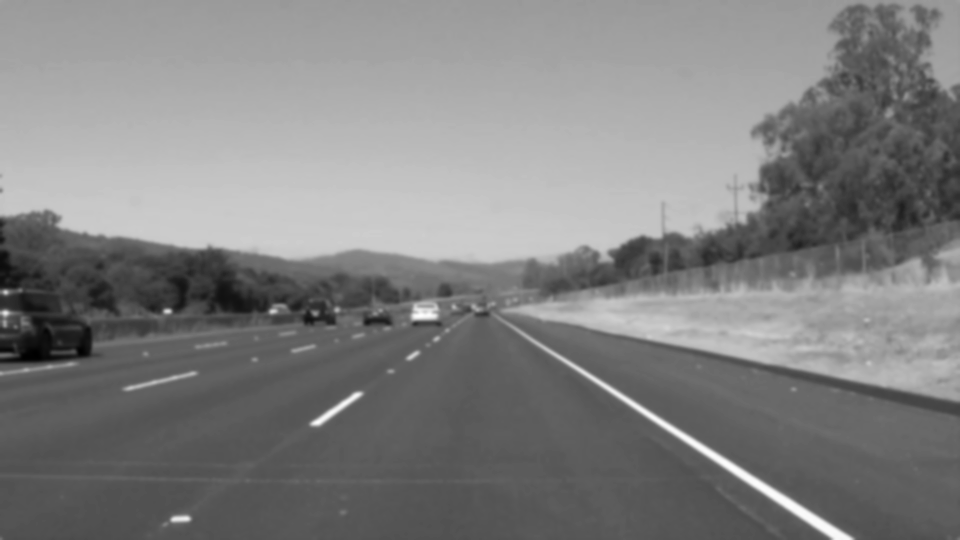
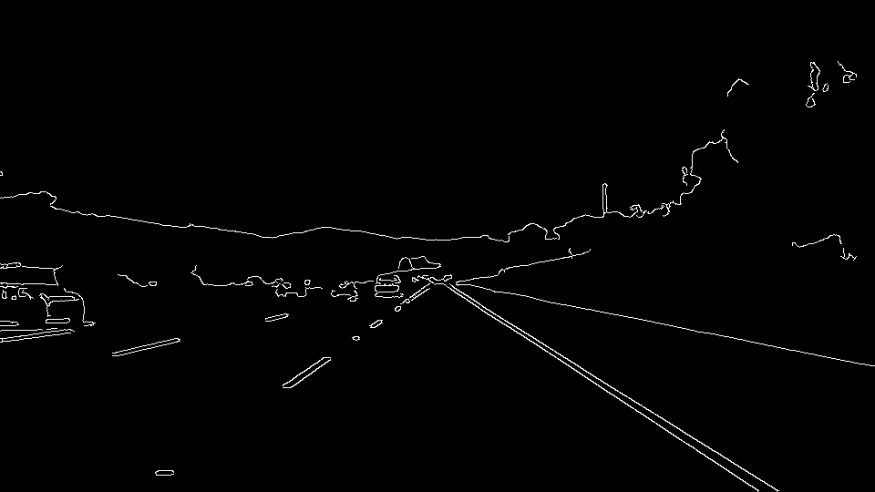
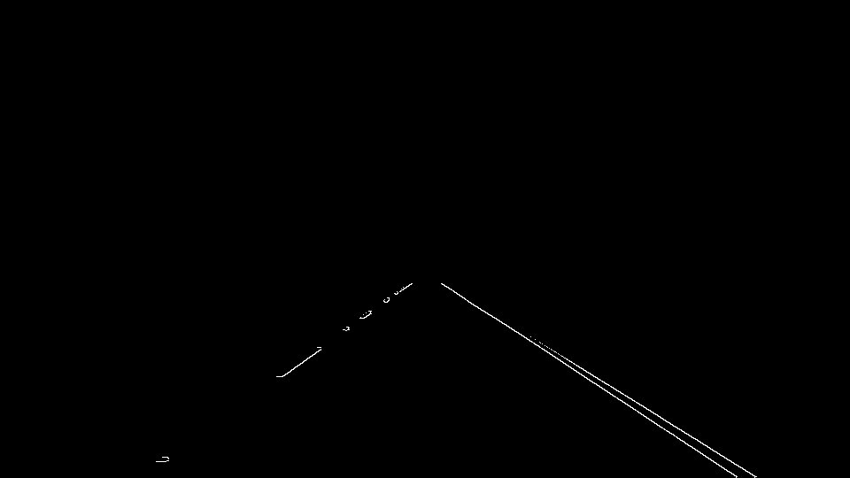
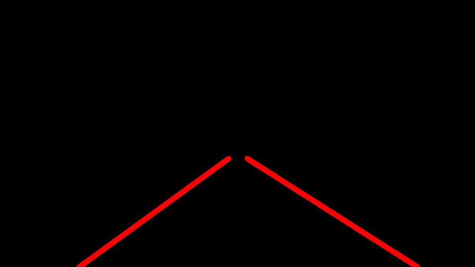
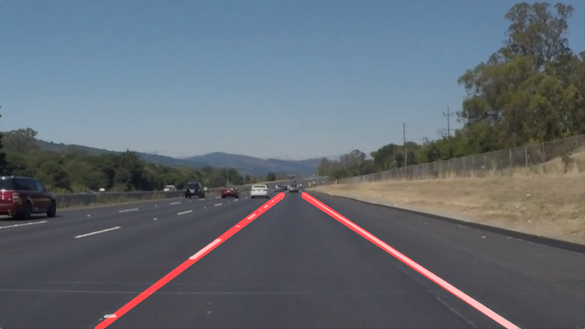

# **Finding Lane Lines on the Road**

---

**Finding Lane Lines on the Road**

The goals / steps of this project are the following:
* Make a pipeline that finds lane lines on the road
* Reflect on your work in a written report

---

### Reflection

### 1. Describe your pipeline. As part of the description, explain how you modified the draw_lines() function.

The pipeline consists of these main steps:
1. Convert image to grayscale. This has the effect of speeding up processing since we are dealing with only one channel.

2. Gaussian blur with kernel_size (5,5) to remove noise and high-frequency pixels in the image

3. Apply Canny detection with threshold 20 - 150

4. Apply region of interest

5. Apply Hough transformation with rho = 1, theta = np.pi/180,
  threshold = 15, min_line_length = 10, max_line_gap = 100
  

6. Overlay the result of Hough transformation on the original image

In the `draw_line()` function, I performed the following steps:
1. Calculate the slope of each pair of points in Hough transformation
2. Average all the negative slopes - this would be the left-lane
3. Average all the positive slopes - this would be the left-lane
4. Using the averaged slopes above, iterate through each set of point to find and average the intercepts for each lane
5. Identify the y-coordinate of the top of the region of interest and the y-coordinate of the bottom of the image
6. Knowing these information, I can now extrapolate from the bottom of the image to the top of the region of interest

### 2. Identify potential shortcomings with your current pipeline

The parameters of these transformations are entirely hardcoded to the image. This means that if any change is to happen to the image (different camera angle, orientation, etc.), the pipeline would not perform very well. It needs to be more dynamic and resilient to different conditions in real life.

One potential shortcoming would be that around a curve where there aren't many pixels making up the straight-line, the Hough transformation might fail if we had hard-coded parameters that require min_line_length to be large.

### 3. Suggest possible improvements to your pipeline

A possible improvement would be to represent the region of interest as a percentage of the image size. This would eliminate the issue of image size changing. However, if the camera angle were to change, that would still be an issue.

Another potential improvement could be to dynamically tune the parameters of the Canny and Hough transformations to be more resilient to real-world conditions.
